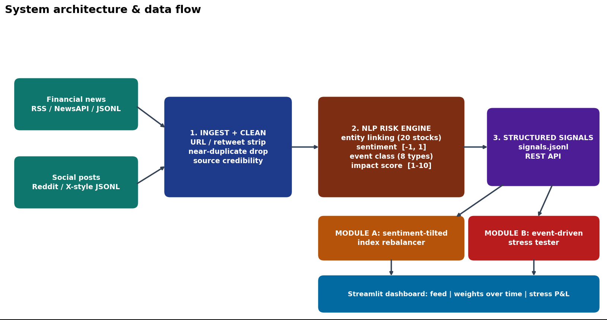
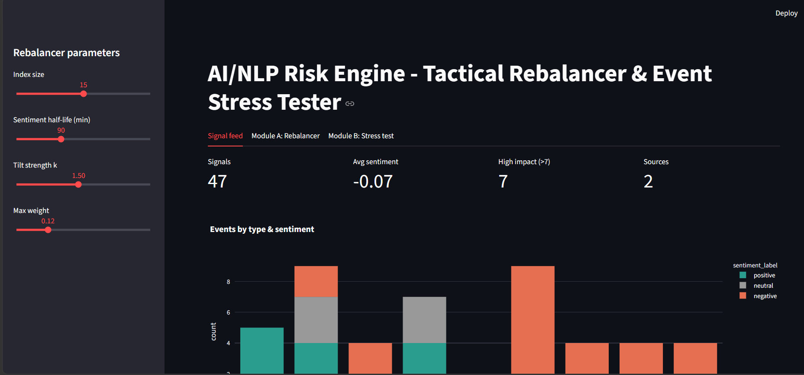
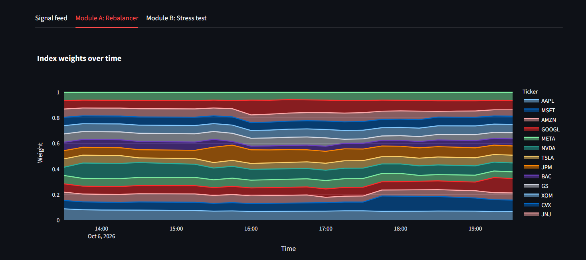
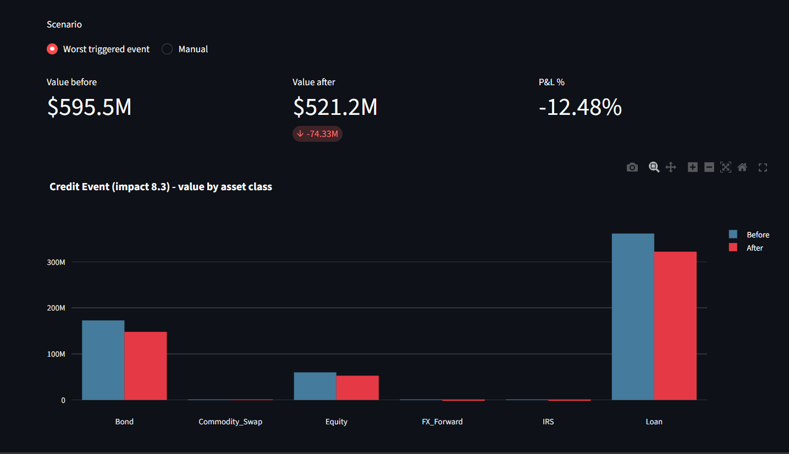
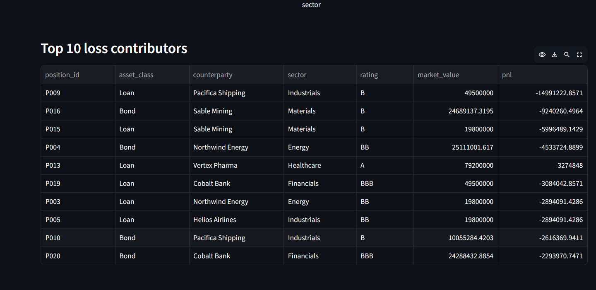

# AI/NLP Risk Signal Platform - S&P Global & Crisil Campus Hackathon

**Candidate Name:** Kurapati Komal Kumar
**College Email ID:** komalkumar.23bce9310@vitapstudent.ac.in
**College / Campus:** Vellore Institute of Technology, Andhra Pradesh (VIT-AP)
**Demo Video Link:** [YouTube unlisted link - add after upload]
**Slide Deck Link (if hosted externally):** Included in repo: [`docs/presentation.pdf`](docs/presentation.pdf)

## 1. Project Overview / Problem Statement & Approach
Risk teams get a huge amount of unstructured text (news and social posts), but decisions need clear numbers. For this case study I built a unified **AI/NLP Risk Engine** that ingests text from two source types (news and social), links each item to a company (or `MARKET`), and emits machine-readable signals: **sentiment score (-1 to 1), event class (8 types), and impact score (1-10)**, via a JSONL file and a REST API.

I implemented **both** downstream modules to show how the signals can be used: **Module A**, a tactical index rebalancer that tilts weights of a 15-stock mock index with decayed sentiment; and **Module B**, a strategic stress tester that revalues a 36-position synthetic wholesale-banking book (loans, bonds, equities, swaps, FX forwards) whenever an adverse high-impact event (impact > 7) is detected.

I kept the method simple enough to explain: a finance word lexicon with negation/emoji handling, a weighted-regex event taxonomy, and an explicit impact formula (`0.55*event prior + 3*|sentiment| + 2*intensity + 1.5*source credibility`, clipped to 1-10). An optional FinBERT backend can be switched on with `SENTIMENT_BACKEND=finbert`.

## 2. Architecture & Tech Stack


- **Python 3.11**, pandas, numpy, FastAPI (API), Streamlit + Plotly (dashboard), pytest (12 tests), matplotlib (docs assets).
- Live connectors (stdlib only): RSS, NewsAPI (`NEWSAPI_KEY`), Reddit public JSON. Demo runs offline on bundled data.
- Layout: `src/risk_engine` (ingest, nlp, engine, api), `src/modules` (rebalancer, stress_test), `src/dashboard`, `data/`, `docs/`, `tests/`.

## 3. Dataset Used
- **All synthetic, written for this project** (no scraped or copyrighted articles, no proprietary or client data): `data/sample_news.jsonl` (24 news items), `data/sample_social.jsonl` (24 social posts incl. a retweet duplicate), `data/sample_portfolio.csv` (36 positions). Regenerate with `python data/make_sample_data.py`.
- Assumptions: 20-stock S&P 100-style universe (first 15 used for the index); social credibility rises with log-engagement (0.3-0.7), news = 1.0; stress shocks are simplified, hand-set scenario values (not calibrated to historical crises); positions marked to a single market value with duration/DV01 sensitivities.
- Live mode (`--live`) reads public RSS/Reddit/NewsAPI feeds at run time; their content is not stored in the repo.

## 4. Quickstart & Installation
Runtime: Python 3.11 on Linux (should work on macOS/Windows).

```bash
git clone <your-repo-url>
cd <repo-folder>
pip install -r requirements.txt
python main.py engine        # writes output/signals.jsonl (add --live for real feeds)
python main.py dashboard     # opens the Streamlit dashboard (all three tabs)
python main.py test          # runs 12 tests
python main.py api           # optional REST API: GET /signals, POST /analyze
```

## 5. Key Results & Domain Impact
**Measured on the bundled demo data (48 documents -> 47 signals after de-duplication):**
- 7 signals are high-impact (>7); all 7 are adverse and trigger a stress test.
- **Module A:** GOOGL (+4.7pp), MSFT (+2.5pp) and PFE (+0.9pp) gain weight after positive news; AAPL, GS and JNJ lose weight. Weights always sum to 100% within 2%-12% bounds; average turnover per 15-min step is 2.2%.
- **Module B:** worst triggered event ("supplier chapter 11, credit downgrade", impact 8.3) cuts the $595.5M book by **$74.3M (-12.5%)**. At a common impact of 8.5: Credit Event -12.8%, Geopolitical -8.3%, Macroeconomic -6.5%, Cyber -3.8%, Regulatory -2.8%.

**Dashboard screenshots (from my own run):**






**Why it matters:** the same structured signal feeds fast trading decisions (index tilt) and slow risk decisions (stress / capital planning), shrinking the gap between a headline and a risk-team response, with every score explainable to a reviewer.

**Honest limitations:** lexicon/regex logic misses sarcasm and context; the rebalancer is not backtested against real prices; stress shocks are illustrative. Next steps: FinBERT fine-tuning, backtest vs equal-weight, streaming ingestion, factor-based and reverse stress tests.

## AI usage & originality
I used AI assistance while building this project, as the guidelines permit, and I reviewed, ran and tested the code myself. All data is synthetic or public; no S&P Global/Crisil/client data is used.
